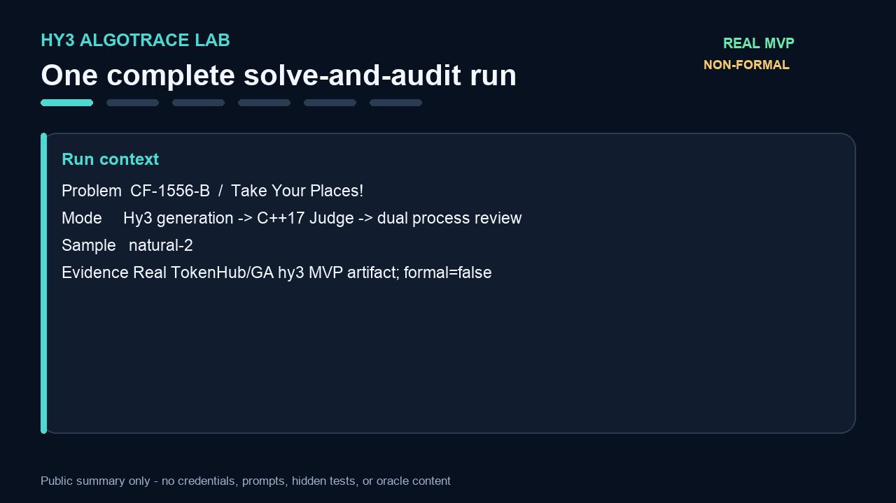

# Two-minute demo



The checked-in GIF is 1280×720, six frames and 36 seconds—well below the two-minute limit.
It is generated from the completed `cf-1556-b` / `natural-2` result of the real GA `hy3`
TokenHub MVP run (`formal=false`), whose source file SHA-256 is
`0f20d9c1344d2eb0ad57eb432d2679380a93aa53b32f912541f4c90520108a40`.

The sequence shows:

1. public problem selection;
2. a structured solution with reasoning steps and C++17;
3. compilation and 203/203 AC Judge summary;
4. isolated logic/adversarial review with agreement;
5. fused final correctness, process validity, score and review flag.

Only aggregate public fields are rendered. Per-test IDs, inputs, expected outputs,
counterexamples, prompts, raw responses, endpoint details, credentials and oracle content are
never drawn.

## Rebuild the GIF

Install the media extra and point the command at an authorised local completed-result artifact.
The output path must not already exist.

```sh
python -m pip install -e '.[media]'
python -m hy3_algotrace.demo_media \
  --result "$HY3_RESULT_JSON" \
  --output docs/assets/demo-next.gif \
  --title "Take Your Places!"
```

The implementation and test are in
[`src/hy3_algotrace/demo_media.py`](../src/hy3_algotrace/demo_media.py) and
[`tests/test_demo_media.py`](../tests/test_demo_media.py). The test checks six frames, a total
duration below 120 seconds, create-only output, and exclusion of test content from the GIF.

## Live local demonstration

For a live run, first start the configured localhost-only API/UI described in the root README.
Then run:

```sh
HY3_DEMO_PROBLEM_ID=<verified-public-id> scripts/demo.sh
```

`scripts/demo.sh` validates the release tree, accepts only an exact
`http://127.0.0.1:<port>` API URL, submits one `solve_and_audit` request, waits for a terminal
state, and prints a safe public summary. Never place credentials in a demo command, recording,
shell history or artifact.
